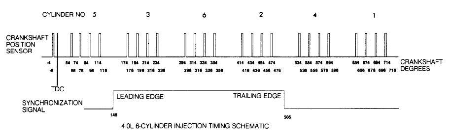

Overview
--------

There are two signals one from the crank wheel and the other from the cam. The crank wheel puts out a series of four pulses every 120 degrees. Each of the four pulses is 20 degrees apart and lasting only 2 degrees. The cam wheel signal is high for 360 crank degrees then low for 360 crank degrees. The decoder does not support sequential fuel or spark. 

Trigger Signal
--------------

